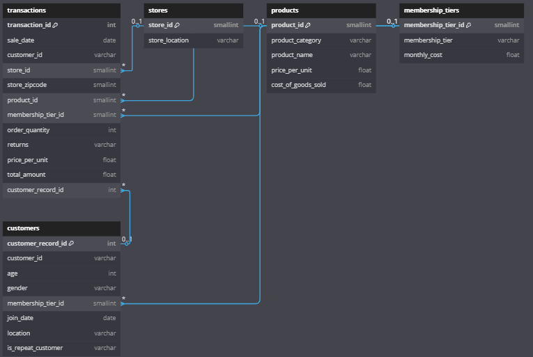
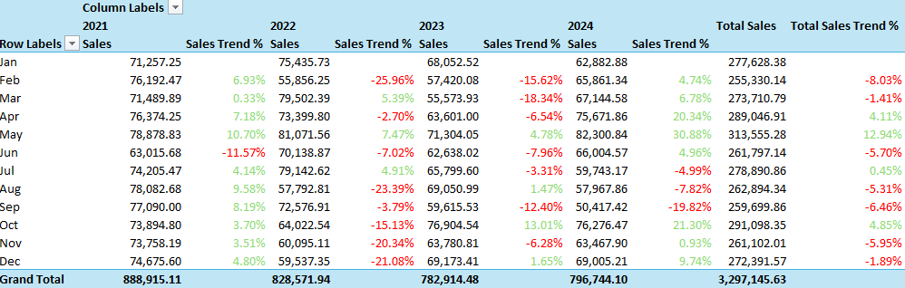
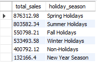
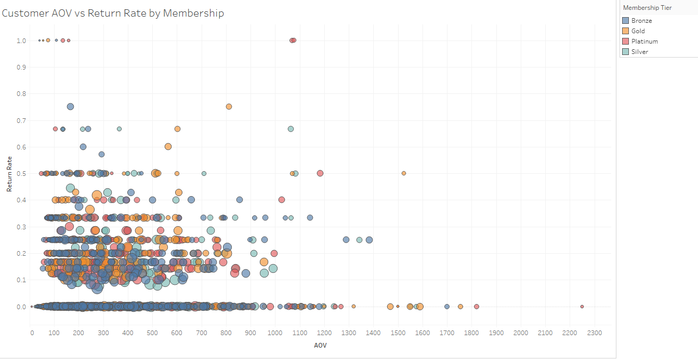
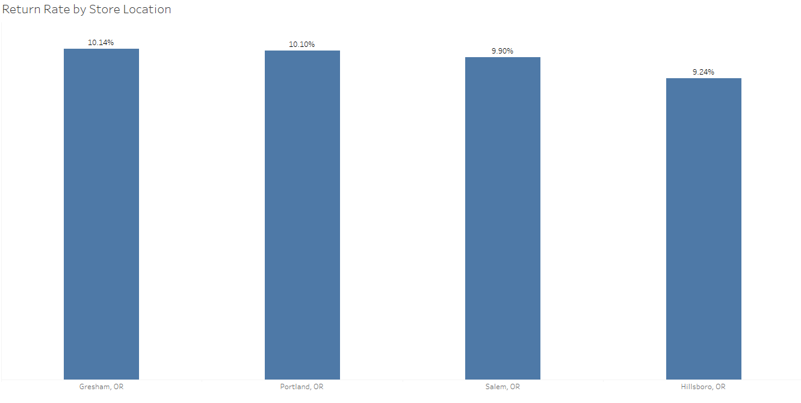
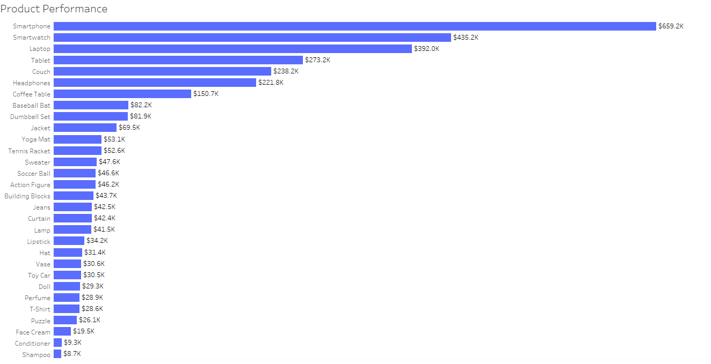
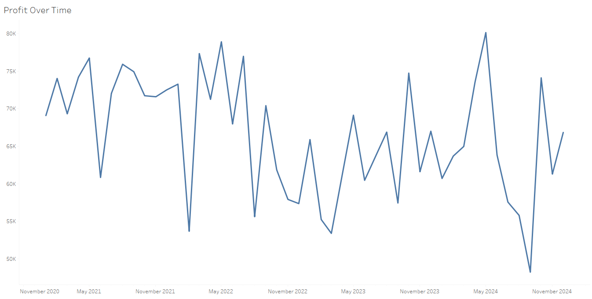

# Retail Performance Analysis 2021-2024: Maximizing Growth while Minimizing Losses

Table of Contents

 - [Project Overview](#project-overview)
 - [Executive Summary](#executive-summary)
 - [Insights](#insights)
   - [Sales Performance & Trends](#sales-performance--trends)
   - [Customer Behavior & Loyalty](#customer-behavior--loyalty)
   - [Store Performance & Optimization](#store-performance--optimization)
   - [Product Performance](#product-performance)
   - [Profitability & Costs](#profitability--costs)
 - [Recommendations](#recommendations)
 - [Stakeholder Questions](#stakeholder-questions)
 - [Data Limitations & Assumptions](#data-limitations--assumptions)
---
# Project Overview
Since 2021, a new store chain in the Willamette Valley(Oregon) has been expanding its footprint, aiming to capture a significant share of the local retail market. As part of this growth strategy, the Regional Manager tasked me with analyzing sales data to uncover key insights that could drive sustainable profitability and improve customer retention.

To ensure a comprehensive analysis, I partnered with another data analyst and collaborated with regional store managers, inventory specialists, and marketing partners to align our findings with business objectives. Our primary focus was to evaluate sales performance across different locations, identify top-performing products, assess return rates, and determine trends in customer purchasing behavior.

This report presents data-driven insights that will help to improve overall sales efficiency. By leveraging sales trends and customer data, we aim to provide actionable recommendations that support the company’s continued success in the valley's competitive retail market.

# Executive Summary
An analysis of 10,000 transactions from 2021 to 2024 reveals that the company generated a total revenue of $3.3 million. However, revenue has been declining at an average rate of 3.5% per year, with 2022 being the worst-performing year—potentially due to COVID-related impacts, which warrant further investigation. Among the company’s locations, the Hillsboro store leads in revenue, contributing 25.6% of total sales. In terms of product categories, Electronics dominate, accounting for 60.1% of total revenue.

Meanwhile, repeat purchase rates have stabilized around 63%, indicating steady customer retention. The company should invest more into the marketing and promotion of their electronics while allocating funds from underperforming products to zone in on their best sellers. The company can also implement bundling deals and LTOs to add more emphasis and attention to otherwise overlooked items. 

# Insights
## Sales Performance & Trends

- The company experienced its highest sales in October 2024, reaching $76.3K in revenue. This could be attributed to the start of the major holiday season, but a comparison of October figures over the past four years would help confirm this pattern.

- In September 2024, the company recorded its lowest revenue of $50.4K after 4 consecutive months of declining sales. However, earnings rebounded exponentially by over 51% the following month, indicating the company's ability to recover from the slump. This strong rebound, with earnings reaching $76.2K in October 2024, highlights the effectiveness of the strategies implemented during the downturn, such as targeted promotions and adjustments to the product lineup. The sharp recovery also suggests that market conditions may have started to stabilize, and customer demand was reignited by the company's responsive actions.

- 2021 was the strongest year for revenue ($888.9K, representing 27% of total revenue), average order value ($347.37), and order volume (2,559 orders). After the first year of operations, sales fell by 12.3% over the next two years, before increasing by 1.8% in 2024.

- There is clear seasonality in sales, with spring and summer holidays and promotional months making up 51% of the total revenue.

- Sales are significantly higher on weekdays, contributing $2.4M, or 73% of total revenue.

## Customer Behavior & Loyalty

- Out of 500 unique customers, 316 are repeat buyers, contributing $2.1M in revenue, which accounts for 64.4% of total sales.

- Female customers primarily favored T-Shirts and Baseball Bats, while male customers preferred Curtains. Customers identifying as "other" were most drawn to Perfume.

- The 40-49 age group generated the highest revenue at $693.4K, closely followed by the 20-29 age group at $673.9K. Both the 30-39 and 40-49 age groups were the most profitable, each achieving a 78.5% profit margin.

- The Gold tier membership is the most popular, with 129 customers enrolled, and it attracts the highest number of new sign-ups. However, the Silver tier has generated the most revenue, totaling $861.3K. Despite being the highest-priced, Platinum tier members have contributed the least in terms of overall spending. It may be worth considering the removal of the Platinum tier to focus on Bronze, Silver, and Gold memberships.

- Repeat purchases (>= 2 purchases) have hovered around 63%, suggesting that the company has a strong loyal core of customers who consistenly make multiple purchases each year.

## Store Performance & Optimization

- The Portland location attracted the highest number of customers and recorded the highest average order value (AOV) at $336.62, reflecting both customer preference for this location and the higher income levels in a larger city. Meanwhile, Gresham and Hillsboro had the fewest total customers, but Gresham’s AOV was only $1.29 lower than Portland’s at $335.33, suggesting that while fewer customers shop at Gresham, those who do tend to spend nearly as much as those in Portland. This could indicate a loyal customer base with higher spending habits despite the lower foot traffic.

- Smartphones were the best selling product across all stores, consistently outperforming other products. This could've benefited from promotional events such as certain discounts, or perhaps bundling deals. Sales at the Salem location were noticeably lower than its counterparts, requiring further investigation as to why.

- Return rates hovered near 10%, but Gresham's location had the highest at a 10.1% rate of returns. This can stem from buyer's remorse, or customer dissatisfaction(i.e poor material quality, inaccurate product descriptions).

- The age group that generated the most revenue at Gresham's store was 40-49, at Portland it was 30-39, at Hillsboro it was 20-29, and at Salem, the 60-69 age group led in earnings, surpassing all other age groups in that store. Weekdays were identified as the best time for shopping, and the 60-69 age group, typically retired or nearing retirement, likely contribute to this trend due to having more free time during the week for shopping and spending more on leisure activities or necessities.

## Product Performance

- Four products—Smartphones, Smartwatches, Laptops, and Tablets—together account for 53.3% of total revenue, with Smartphones contributing 25% of all sales on their own.

- Shampoo has the highest order quantity at 386 units but generates the lowest earnings at just $8.7K. This is likely due to its low price point or the fact that it is frequently bundled in promotions. In line with this, the Beauty category has the highest order count but represents only 3.1% of total revenue.

- Sweaters have the highest repeat purchase rate at 31.2%, followed by Shampoo and Dumbbell Sets at 30.6% and 29.7%, respectively. On the other end of the spectrum, Lamps (22.7%) and Toy Cars (23.1%) have the lowest repeat purchase rates.

- The company-wide product return rate is 9.8%. This could be attributed to factors like customer dissatisfaction, poor product quality, or other unidentified reasons. Hats have the lowest return rate at just above 6%, while Smartwatches top the list with a return rate of 13.3%. Given their strong sales, this high return rate warrants further investigation.

## Profitability & Costs

- The total profit across all stores is just under $2 million, retaining 60% of total revenue

- October is historically the most profitable month, with a profit margin of 79.2%. November follows closely with a 78.7% margin, suggesting that the fall holiday season is an excellent opportunity to optimize promotions and bundles for lower-performing products. While profit margins generally hover around 78%, May stands out with the lowest margin at 77.6%. February, despite generating the least revenue, has the fourth-highest profit margin at 78.3%, which suggests a preference for highly profitable items during this month—potentially driven by beauty product promotions for Valentine's Day.

- To address the previous point, Beauty products have an impressive 84% profit margin, second only to Toys at 86.7%. This explains why February, despite its low revenue, still boasts a strong profit margin. Interestingly, Beauty products were the top sellers only in February 2022.

- No products were bought together, indicating that the company operates more like a one-stop shop where customers either grab a quick item or come with the intention of purchasing one high-priced product. This warrants further investigation into why customers aren't making multiple-item purchases more frequently.

# Recommendations

### Sales Performance & Trends

 - **Capitalize on Holiday Seasons**: Given that October 2024 was the highest sales month, leveraging the holiday season as a prime time for promotions is key. Continue comparing October trends across the years to build targeted marketing strategies and optimize product offerings for future holiday seasons.
   
 - **Address Revenue Decline Post-2021**: The decline in revenue from 2021 should be investigated further, including customer feedback and external factors such as economic trends or increased competition. Consider revisiting the marketing strategies, inventory, and product selection during those two years to pinpoint the reasons behind the dip and mitigate any recurring issues.

 - **Optimize Spring and Summer Sales**: With 51% of total revenue stemming from spring and summer holidays and promotional months, it's important to further capitalize on seasonal campaigns by offering exclusive deals and bundled promotions. Make sure these months remain a strong focus for high-revenue products, such as Smartphones and Smartwatches.

 - **Maximize Weekday Revenue**: Weekday sales make up a significant portion of total revenue. Continue focusing on weekday-specific promotions, possibly using targeted discounts or loyalty rewards, to drive consistent weekday sales. Further research can uncover opportunities for less busy weekdays to see if there are specific opportunities for increasing foot traffic and conversion rates.

### Customer Behavior & Loyalty

 - **Strengthen Customer Loyalty Programs**: Given the strong repeat purchase rate of 63%, ensure that the company continues to enhance its loyalty program, especially for the Gold and Silver tiers, which show the most value. Additionally, consider introducing special perks for repeat buyers to further increase their lifetime value.

 - **Review Membership Tiers**: With the Platinum tier underperforming in revenue, consider revising or eliminating the Platinum tier in favor of focusing on the Bronze, Silver, and Gold memberships. Offering attractive benefits for the middle tiers could incentivize customers to upgrade.

 - **Target Age Groups**: The 40-49 age group, which generated the most revenue, along with the 20-29 and 30-39 age groups, should be targeted for customized offers. Consider special promotions for each group based on their product preferences (e.g., T-Shirts, Baseball Bats, and Curtains) and ensure that products popular with these age groups are well-stocked.

### Store Performance & Optimization

 - **Optimize Store-Specific Promotions**: While Portland’s AOV is the highest, Gresham's AOV is only slightly lower, which suggests a highly engaged but smaller customer base. Consider investing in localized marketing for Gresham and Hillsboro to increase foot traffic, while maintaining the personalized experience that drives their higher AOVs.

 - **Understand Salem’s Underperformance**: Salem's lower sales need further exploration. Factors such as location, store layout, or customer preferences could be contributing. Running targeted surveys or customer feedback programs in Salem could provide insights into specific barriers, such as product selection or local competition.

 - **Investigate High Return Rates for Smartwatches**: The high return rate for Smartwatches (13.3%) should be closely analyzed. There may be an issue with product quality, customer expectations, or misalignment between the product’s features and customer needs. In-depth feedback or a customer satisfaction survey could help uncover the root cause.

## Product Performance

 - **Increase Focus on High Revenue Products**: Smartphones, Smartwatches, Laptops, and Tablets drive a significant portion of revenue. Consider bundling these products with complementary items (e.g., phone cases, laptop accessories) or offering seasonal discounts to boost their sales further.

 - **Promote Repeat Purchase Items**: Sweaters, Shampoo, and Dumbbell Sets have the highest repeat purchase rates. Consider creating loyalty offers, cross-selling, or recommending these items to encourage customers to purchase them again. This strategy could increase revenue by focusing on customer retention.

 - **Address Low Revenue from Shampoo**: Although Shampoo has a high order volume, it generates low earnings. Offering it as part of a bundle or increasing the price slightly could improve its revenue contribution, especially during promotional periods.

## Profitability & Costs

 - **Optimize Profit Margins in Low Revenue Months**: Since October and November are the most profitable months, consider focusing on driving higher revenue during months like May, which has a lower margin. Adjust marketing strategies to align with the peak periods and ensure that lower-performing months are optimized through targeted discounts and promotions.

 - **Maintain High Profit Margins for Beauty and Toys**: Beauty products and Toys have the highest profit margins. Consider capitalizing on this by offering bundled deals or creating exclusive offers during key months such as Valentine’s Day for beauty items, to drive further revenue.

 - **Investigate the Lack of Product Bundles**: The lack of multi-product purchases suggests an opportunity to offer product bundles, perhaps promoting complementary items together. Testing bundle offers could provide insight into whether customers are willing to purchase multiple items when incentivized with discounts or exclusive deals.
---

# Stakeholder Questions

- Before moving on, are there any KPIs or business objectives that need to be prioritized? Such as customer retention, creating product bundling or improving overall store performance?

- Were there bundled purchases that haven't been entered into the database? It's very unlikely(although possible) that every purchase was only for one item.

- Do we need to incorporate external factors, such as economic trends or competitor performance, into our analysis?

---

# Data Limitations & Assumptions

**Assumptions**
 - Sales are influenced by seasonal trends – We’re assuming that spikes in sales are mostly due to holidays and promotions. But other things like economic changes or unexpected events could also play a role.
 - Customer buying habits stay the same – We’re treating customer behavior as fairly stable, but in reality, trends shift, and preferences can change over time.
 - Store performance reflects local shoppers – Each store’s success is assumed to be tied to the demographics of the surrounding area. But other factors, like competition or local events, might also be at play.
 - Repeat customers != loyal customers – Just because someone buys more than once, we assume they’re loyal. But that doesn’t necessarily mean they’re happy with the brand it could just be convenience.
 - Profit margins are steady – We’re assuming that costs and pricing don’t change much, but things like inflation or supplier price hikes could impact profitability.
 - Online and in-store shoppers behave similarly – If the dataset combines both types of transactions, we’re assuming they follow the same trends. But in reality, online shoppers may behave very differently from in-store customers.
   
**Data Limitations**
 - We don’t have market-wide data – The analysis only looks at our company’s numbers, so we’re missing things like competitor pricing, economic trends, and supply chain disruptions that could affect sales.
 - We don’t know if customers buy items together – The data makes it seem like people buy just one item at a time, but without detailed cart data, we can’t be sure. Maybe they are bundling items, but we just don’t see it.
 - Some customer info might be missing – If age or gender data is self-reported or incomplete, the insights on customer preferences might not be totally accurate.
 - We can’t see the full impact of marketing – We’re looking at revenue trends, but there’s no clear way to link them directly to specific ads or promotions. That makes it hard to tell what’s working.
 - We don’t know why people return items – We see return rates, but there’s no direct customer feedback. Are people unhappy with quality? Was the product not what they expected? We can’t say for sure.
 - Membership data might not tell the full story – We know which tiers are most popular, but we don’t have data on how memberships actually affect spending behavior.
 - We’re looking at past data, not predicting the future – This analysis helps us understand trends, but it doesn’t include forecasting or real-time tracking to predict what’s coming next.
- The data is synthetic, it was created using ChatGPT and Python libraries. It was designed to mimic real trends as closely as possible, but it's not perfect in any means.

---

- To view the SQL queries used, [click here.](https://github.com/amontaywelch/retail_performance_2021_2024/blob/main/sales_analysis_2025.sql)
- To view my portfolio that includes projects similar to this one, [click here.](https://amontaywelch.carrd.co/#)
- Check out my LinkedIn [here](https://www.linkedin.com/in/amontay-welch/) to connect and talk about data!

  

