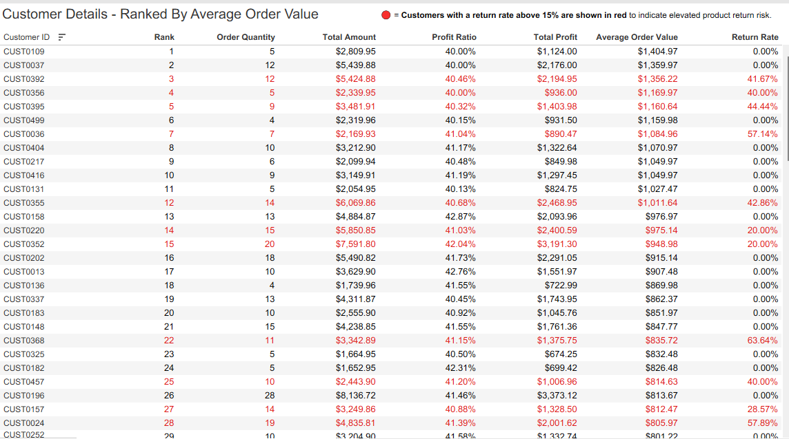
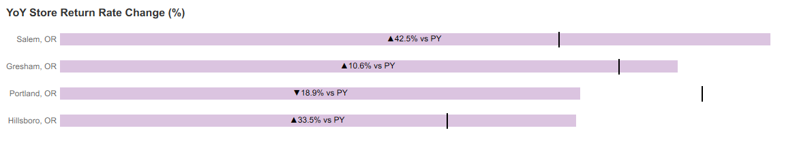
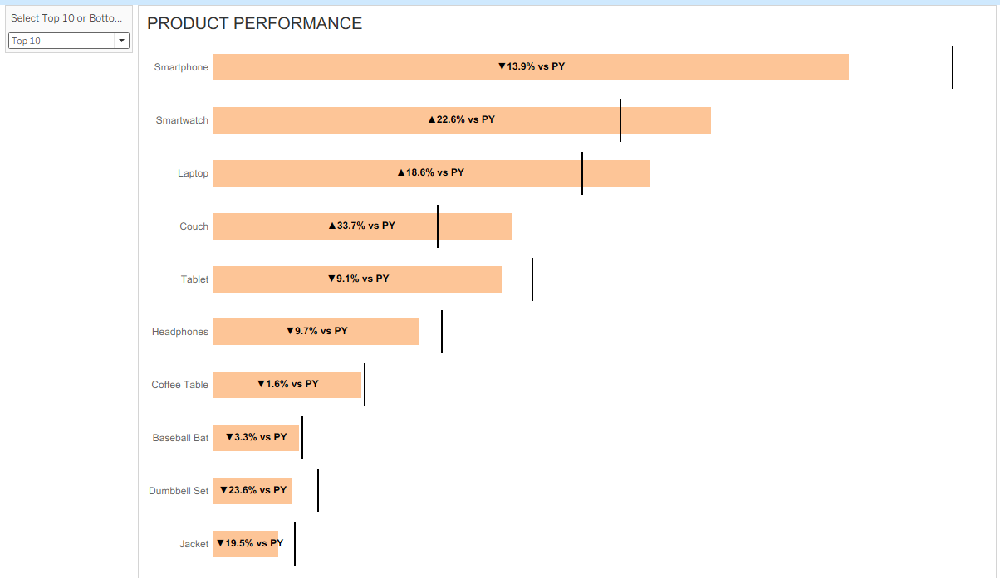
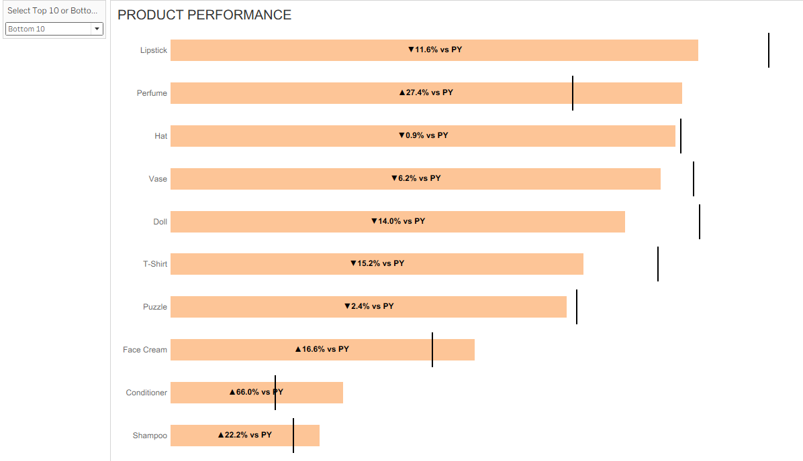
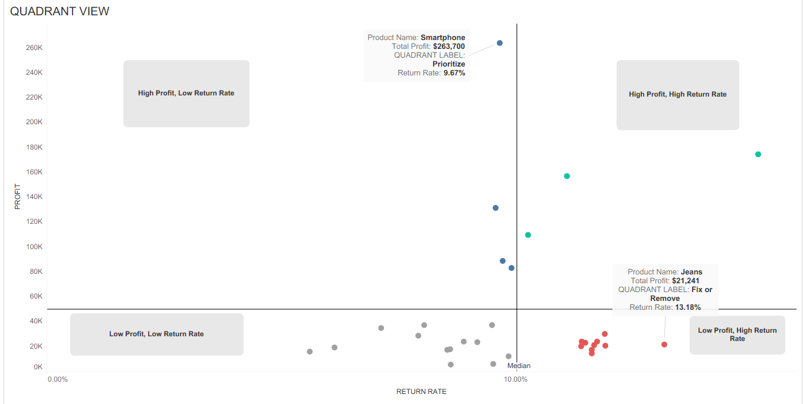

# Retail Performance Analysis 2021-2024: Maximizing Growth while Minimizing Loss

Table of Contents

 - [Project Overview](#project-overview)
 - [Executive Summary](#executive-summary)
 - [Insights](#insights)
   - [Sales Trends & Seasonality](#sales-trends--seasonality)
   - [Customer Behavior & Loyalty](#customer-behavior--loyalty)
   - [Store Performance & Optimization](#store-performance--optimization)
   - [Product Performance](#product-performance)
   - [Profitability & Costs](#profitability--costs)
 - [Strategic Recommendations](#strategic-recommendations)
 - [Stakeholder Questions](#stakeholder-questions)
 - [Data Limitations & Assumptions](#data-limitations--assumptions)
---
# Project Overview
Between 2021 and 2024, a fast-growing retail chain in Oregon sought to improve profitability, optimize its product and store strategy, and retain high-value customers. As part of that mission, I conducted a deep-dive analysis of transactional, product, and customer data across all locations.

The goal: **translate sales and customer behavior into actionable strategies** that would reduce product returns, boost revenue, and refine the chain's loyalty program. This analysis focuses on: 
 - Identifying high-margin, high-retention product opportunities.
 - Diagnosing revenue declines and store performance.
 - Segmenting customer behavior to improve loyalty & retention.
 - Leveraging seasonality and weekday patterns to time promotions.
 - Reducing return rates and uncovering reasons behind product churn.

The result is an insight-driven, detailed strategy tailored to help the business grow more profitably, retain more customers, and operate more efficiently. 

## Executive Summary

From 2021 to 2024, the retail chain generated **$3.3 million in revenue** across **10,000 transactions**, with notable shifts in performance over time:

- **Revenue declined 3.5% annually**, with 2022 as the weakest year — likely due to pandemic aftershocks and shifting consumer behavior.
- **Hillsboro led all stores**, contributing **$844.7K (25.6%) of total revenue**.
- **Electronics dominated**, accounting for **nearly $2M (60.1%) of revenue**, driven by Smartphones and Smartwatches.
- **Customer retention remained strong** — 63% of customers made repeat purchases, led by the **40–49** and **20–29** age groups.
- **Weekday sales accounted for 73%** of revenue, suggesting strong engagement during standard business hours.
- **Profit margins averaged 60%**, with **Beauty (84%)** and **Toys (86.7%)** yielding the highest margins.
- **October and November were the most profitable months**, fueled by seasonal demand and high-margin product sales.
- **Smartwatch return rates reached 13.3%**, well above average, signaling a need for product or positioning review.
- **Membership tiers showed imbalance** — Silver generated the most revenue, while Platinum underperformed despite premium positioning.

This analysis delivers **a clear, data-driven strategy** for improving store performance, optimizing the product mix, and increasing customer lifetime value.

# Insights
## Sales Trends & Seasonality

- 2021 was the strongest year, generating $888.9K in revenue — 27% of total sales — with the highest order volume (2,559) and AOV ($347.37).
- Revenue declined by 12.3% over the next two years, followed by a modest 1.8% recovery in 2024.
- May 2024 peaked at $82.3K in revenue, followed up by a 38.7% drop between May and September, before recovering in October 2024.
- Spring and summer months drove 51% of total revenue, indicating strong seasonal sensitivity.
- Weekday sales made up 73% of revenue, reflecting consistent weekday engagement and demand during standard business hours.

**Key Opportunity**: Double down on seasonal promotions and weekday loyalty incentives to capitalize on these consistent high-performing windows.

## Customer Behavior & Loyalty

- Out of 500 unique customers, 316 (63%) made repeat purchases, contributing $2.1M in revenue.
- The 40–49 and 20–29 age groups were the most profitable, generating $693.4K and $673.9K respectively.
- Female customers favored T-Shirts and Baseball Bats; male customers preferred Curtains; customers identifying as “Other” showed high engagement with Perfume.
- The Silver membership tier generated the most revenue ($861.3K), despite Gold having the most members. The Platinum tier underperformed despite its premium pricing.
- Repeat purchases have consistently held around 63% annually, showing a loyal customer base across time.

Key Opportunity: Focus retention strategies on the 20–49 age range and reevaluate or restructure the Platinum tier. Target cross-sell and personalization efforts by membership tier and demographic behavior.

## Store Performance & Optimization

- Portland had the highest number of customers and the highest average order value (AOV) at $336.62.
- Gresham, despite fewer customers, had a nearly identical AOV ($335.33), suggesting a loyal, high-spending base.
- Hillsboro led in total revenue contribution (25.6%), while Salem underperformed significantly.
- Gresham had the highest return rate at 10.1%, above the company average of 9.8%, pointing to potential product quality or service issues.
- Age group performance varied by location:
  - Gresham: 40–49 age group drove the most revenue
  - Portland: 30–39
  - Hillsboro: 20–29
  - Salem: 60–69

Key Opportunity: Investigate Salem’s underperformance and Gresham’s return rate. Consider tailored inventory, promotions, or layout adjustments by store based on local age demographics and spending patterns.

## Product Performance

- Four products — Smartphones, Smartwatches, Laptops, and Tablets — accounted for 53.3% of total revenue, with Smartphones alone contributing 25%.
- Shampoo had the highest unit sales (386 orders) but generated only $8.7K in revenue, likely due to low pricing and frequent bundling.
- The Beauty category had the highest total order count but just 3.1% of total revenue, reinforcing its role as a volume-driven, low-margin category.
- Products with the highest repeat purchase rates:
  - Sweaters (31.2%)
  - Shampoo (30.6%)
  - Dumbbell Sets (29.7%)
- Smartwatches had the highest return rate at 13.3%, well above the 9.8% average.
- Hats had the lowest return rate at just above 6%.

Key Opportunity: Focus on bundling high-frequency items like Shampoo and Dumbbell Sets with higher-ticket products. Investigate Smartwatch return causes and refine product positioning or quality controls.

## Profitability & Costs

- Total profit across all stores was just under $2 million, with an average profit margin of 60%.
- October and November were the most profitable months, with margins of 79.2% and 78.7%, driven by seasonal demand and high-margin products.
- February had the lowest revenue, yet delivered the fourth-highest profit margin (78.3%) — likely due to strong Beauty product sales aligned with Valentine’s Day promotions.
- May had the lowest margin (77.6%), indicating underperformance despite being part of a promotional season.
- Beauty and Toy categories led in profit margins at 84% and 86.7%, respectively.
- No evidence of bundled product purchases — customers typically bought single items per transaction.

Key Opportunity: Promote high-margin products like Beauty and Toys more aggressively in lower-revenue months. Introduce product bundles to increase order value and improve transaction efficiency.

## Strategic Recommendations

This analysis highlights five urgent, high-impact actions to improve revenue, margin, and retention:

1. **Redesign the loyalty strategy around the 20–49 age group**
   - Action: Launch targeted email and SMS campaigns offering exclusive discounts, product bundles, or early access to top sellers.
   - Why: These customers generate the majority of repeat revenue and respond well to personalized offers.

2. **Eliminate or restructure the Platinum membership tier**
   - Action: Sunset the Platinum tier or convert it into an invite-only rewards program for high-value customers.
   - Why: Platinum contributes the least revenue despite premium pricing — streamlining tiers improves program efficiency and upsell targeting.

3. **Investigate and resolve Smartwatch return drivers (13.3% return rate)**
   - Action: Review product reviews, issue post-purchase surveys, and run a test with clearer product descriptions and enhanced packaging.
   - Why: Smartwatches are a top seller, but high return rates erode margin and customer satisfaction.

4. **Test bundled product offers to increase average order value (AOV)**
   - Action: Create 3–5 product bundles combining high-frequency, low-revenue items (e.g., Shampoo, Dumbbells) with premium products.
   - Why: No current evidence of multi-item orders — bundling is a low-risk way to increase unit economics.

5. **Scale Q4 marketing around Beauty and Toys**
   - Action: Allocate a larger share of paid ads, homepage placements, and influencer campaigns to these categories in October–November.
   - Why: They have the highest margins (84–87%) and perform exceptionally during the holiday season.

6. **Reduce High-AOV Return Risk**
   - Action: Identify high-AOV customers with excessive return behavior (40%+) and evaluate order patterns or potential misuse.
   - Why: Return losses are most damaging when tied to high-profit, high-volume customers.

These actions provide a fast path to improving revenue quality, increasing retention, and protecting margin — without major operational overhaul.

## Strategic Recommendation Matrix

|                          | Low Effort                              | High Effort                            |
|--------------------------|------------------------------------------|----------------------------------------|
| **High Impact**          | - Restructure Loyalty Tiers (Platinum)    - Promote Beauty/Toys in Q4 | - Investigate Smartwatch Returns       |
| **Moderate Impact**      | - Targeted Offers for Ages 20–49         | - Launch Product Bundles               |

---

## Stakeholder Questions

Before moving forward, there are a few critical areas where strategic alignment or additional data may be needed:

1. **Customer Retention Priority:**  
   Is customer retention a core KPI for the upcoming fiscal year? If so, should efforts prioritize loyalty tier optimization, repeat purchase campaigns, or age-targeted personalization?

2. **Bundling Strategy Feasibility:**  
   Are there operational or POS limitations preventing bundled product purchases from being tracked or executed? Could bundling be piloted in select stores or online channels?

3. **Smartwatch Return Investigation:**  
   Do we have product review data or customer feedback surveys to help identify root causes of the 13.3% return rate? Would launching a post-return survey be feasible?

4. **Marketing Budget Allocation:**  
   Should a larger share of Q4 marketing be shifted toward Beauty and Toy categories given their margin advantage, or would that conflict with broader brand strategy?

5. **Platinum Tier Restructuring:**  
   Are there contractual or branding reasons to keep the Platinum tier in place, or is there internal support to sunset or repackage it?

These questions can help determine where to focus resources and what trade-offs should be made to drive near-term gains without compromising long-term strategy.

---

## Data Limitations & Assumptions

### Assumptions

- **Customer behavior is consistent year over year:**  
  Trends and retention rates are assumed to be stable, though shifting preferences or macro factors could impact future behavior.

- **Store performance reflects local demand:**  
  Revenue and AOV are assumed to be tied to local demographics, though other factors (e.g., competition, staffing) may also play a role.

- **Repeat purchases indicate loyalty:**  
  Customers with 2+ purchases are assumed to be brand-loyal, but actual satisfaction levels are unknown.

- **Profit margins remain relatively constant:**  
  Margins are calculated based on available data and may not reflect real-time changes due to inflation, supply chain disruption, or discounting.

- **Online vs in-store behavior is blended:**  
  No separation was made between ecommerce and physical store activity, which could affect insights around shopping patterns.

### Data Limitations

- **No market-wide context:**  
  This analysis is based solely on internal data — external trends (e.g., competitor performance, economic shifts) are not included.

- **Lack of basket-level transaction data:**  
  The data treats each product as a separate transaction, making it difficult to determine if products were purchased together (bundling insights are inferred).

- **Missing customer sentiment data:**  
  No reviews, survey results, or NPS scores were available to support return rate analysis or satisfaction-based recommendations.

- **Membership behavior tracking is limited:**  
  While revenue by tier is captured, the impact of membership perks on behavior (e.g., frequency, AOV) is not explicitly tracked.

- **Synthetic dataset:**  
  This is a simulated retail dataset designed to replicate real-world scenarios. While it reflects common patterns, it may not capture all edge cases or real-world complexity.

---

- [View the full SQL codebase.](https://github.com/amontaywelch/retail_performance_2021_2024/blob/main/sales_analysis_2025.sql)
- [Explore similar analyses in my portfolio.](https://amontaywelch.carrd.co/#)
- [Let's connect on LinkedIn!](https://www.linkedin.com/in/amontaywelch/)
